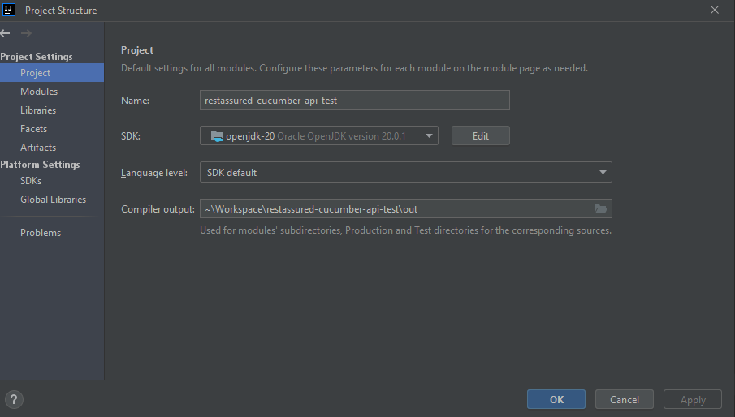
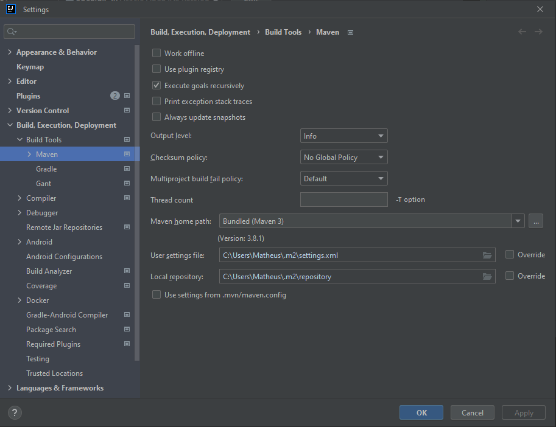
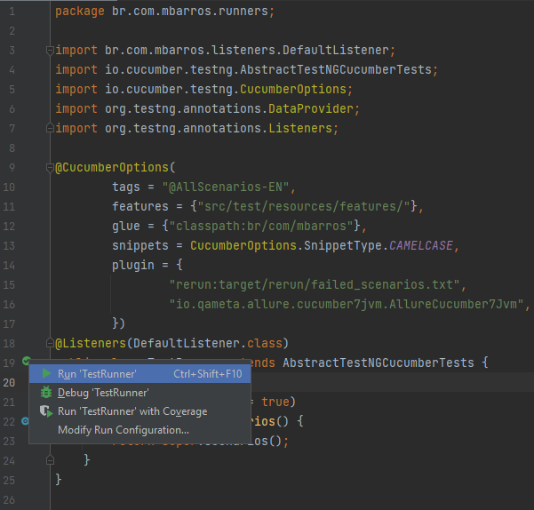
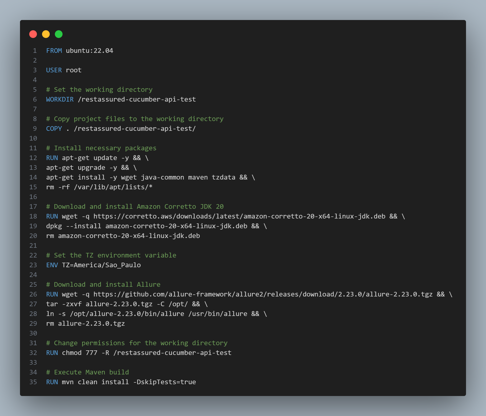

# restassured-cucumber-api-tests

The `restassured-cucumber-api-tests` is a sample project that uses Java, RestAssured, Allure, TestNG, Cucumber, and Faker for API testing automation.

## Project Description

This project is a demonstration of API testing automation using popular technologies in the Java ecosystem. The goal is to show how to perform automated API testing by integrating various popular tools.

The project uses the `RestAssured` framework to make HTTP requests to the APIs, `Allure` for generating interactive test reports, `TestNG` as the testing framework, `Cucumber` for writing test scenarios in Gherkin, and `Faker` for generating random test data.

## Resources and Technologies Used

- Java: Programming language used for developing the test automation.
- RestAssured: Java framework for testing and validating RESTful APIs.
- Allure: Tool for generating interactive test reports.
- TestNG: Testing framework used for executing tests in a structured manner.
- Cucumber: Framework for writing and developing test scenarios.
- Faker: Java library for generating random test data.

## Prerequisites

Make sure you have the following prerequisites installed in your development environment:

- Java JDK 17 or higher
- Maven
- IDE (IntelliJ)

## How to Run?

- Locally
- Docker

**Locally**

To run the project locally, I used IntelliJ with JDK 20 and integrated Maven.

- Open JDK:
  

- Maven:
  

The execution is performed via TestRunner:

- Runner:
  

**Docker**

To run it in Docker, I created a Dockerfile that has Ubuntu as the OS with all the necessary dependencies:

To run the project using Docker, you'll need to perform the following steps:

1. **Step 1: Docker.**
   - 1.1 Have Docker installed.
   - 1.2 Docker needs to be running.

2. **Step 2: Project.**
   - 2.1 Open a terminal in the project folder.

3. **Step 3: Commands.**
   - 3.1 Execute the command `docker build -t restassured-cucumber-api-tests .`
   - 3.2 After finishing the image build, execute the command: `docker images` and find the image ID
   - 3.3 Execute the following command: `docker run -it --rm --name restassured-cucumber-api-tests -p 8080:8080 yourImageIdHere bash`

4. **Step 4: Running the Tests**
   - 4.1 If you want to run the regression tests, execute the command: `mvn test`
   - 4.2 If you want to run a specific tag: `mvn test -Dcucumber.filter.tags=@addUser`

5. **Step 5: Allure Reports**
   - 5.1 Regardless of the chosen execution method, whether it's Dockerized or using the IntelliJ IDE, 
   to open the allure report, simply execute the following command: `allure serve reports/allure-results -p 8080`

## Parallelism

The test execution is already parallel by default, but we can disable it or configure the number of tests that will run in parallel.

To disable parallelism, we need to modify the TestRunner file and set the value of `parallel` to `false`.

To configure the number of scenarios that will run in parallel, the `parallel` value in the TestRunner file should be 
set to true, and we have two configurable properties: `featureThreadCount` and `scenarioThreadCount`.

- featureThreadCount: Defines the number of .feature files that will be executed in parallel.
- scenarioThreadCount: Defines the number of Scenarios and Scenario Outlines that will be executed in parallel.

These properties should be passed via Maven command line:

`mvn test -DfeatureThreadCount=5 -DscenarioThreadCount=10`

In the example above, it will execute up to 5 .feature files and 10 scenarios in parallel, allowing for a total of 50 scenarios being executed concurrently.